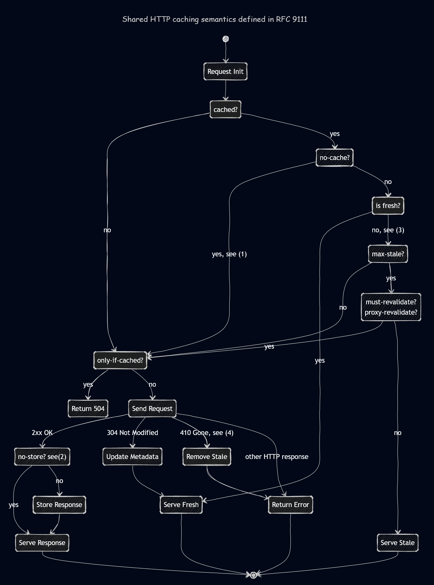

## Overview

### Shared HTTP Cache Semantics

This implementation models a shared HTTP cache that follows the semantics defined in [RFC 9111](https://datatracker.ietf.org/doc/html/rfc9111.html), with explicitly documented assumptions and controlled decisions. It uses a content-addressed cache through [cacache](https://github.com/npm/cacache) providing lockless, high-concurrency cache access, that along with the downloaded `content` is storing the associated `HTTP response headers` in the cache metadata. Overall, the design aims to provide `browser-like` caching behavior in a `Node.js` environment.

### Scope and assumptions

The cache is shared (not private) and applies shared-cache rules.

- Request `methods` other than `GET` are not stored.
- Private responses (request `Authorization` header, response `Cache-Control="private"` and `Set-Cookie` headers) are not stored.
- Variant responses (response header `Vary` present) are not stored.
- Partial content (response `Content-Range` header) is not stored.
- Time calculations rely exclusively on locally recorded timestamps, not on server-provided `Date`.
- No heuristic freshness is used.
- Storage and eviction are deterministic; no background or implicit cleanup is assumed.

### Request initialization and cache lookup

Each request begins by determining whether a cached response exists.

If no cached entry exists:

- If the request `Cache-Control` header has `only-if-cached` directive, the cache returns a `504 HTTP status`.
- Otherwise, the request is sent to the origin server.

### Cache-Control exclusions

Two `Cache-Control` directives may short-circuit normal cache usage:

- `no-cache` (request or response): cached data cannot be used without revalidation.
- `no-store` (request or response): the response must not be stored.
  When `no-store` applies, the response is served directly and bypasses storage entirely.

### Freshness evaluation

If a cached response exists and is not excluded, strict freshness is evaluated first.

Freshness lifetime is computed from response headers:

- `Cache-Control` header's`s-maxage` directive first, then `max-age`, if present
- otherwise `Expires` header, if present

Current age is derived from local metadata:

```excel-formula
currentAge = now − storedTime + incomingAge
```

The `incomingAge` is taken from the stored response `Age` header, if present.

Remaining freshness:

```excel-formula
remainingFreshness = freshnessLifetime − currentAge
```

If request `Cache-Control` header includes `min-fresh` directive, its value is deducted from the `remainingFreshness`:

```excel-formula
remainingFreshness = remainingFreshness − minimumFreshness
```

If `remainingFreshness ≥ 0`, the response is served as fresh.

### Stale handling

If the response is stale, request `Cache-Control` header's `max-stale` directive is evaluated, if present.

If `max-stale` is present, but its value is unspecified → accept any staleness; otherwise the response is acceptable if:

```excel-formula
currentAge ≤ freshnessLifetime + maximumStaleness
```

If staleness exceeds the acceptable `max-stale`, the cache proceeds toward revalidation or origin fetch.

### Revalidation constraints

Even that request `Cache-Control` header's `max-stale` directive allows use of stale data:

- response `Cache-Control` header's `must-revalidate` or `proxy-revalidate` diretives forbids serving stale.
- In that case, the cache must revalidate or fetch from the origin.
- If request `Cache-Control` header's `only-if-cached` directive also applies, the cache returns a `504 HTTP status` instead of revalidating.
- If no revalidation constraint applies, stale content may be served.

On revalidation, if the cached content includes `ETag` or `Last-Modified` automatically `If-None-Match` and `If-Modified-Since` headers are added to the request. Revalidated entries are explicitly replaced during each successful fetch to avoid unbounded growth in the index.

### Origin request outcomes

When a request is sent to the origin:

- `2xx`: response is stored (unless restricted) and served.
- `304 Not Modified`: cached metadata is updated; response is served as fresh.
- `410 Gone`: cached entry is removed.
- Other responses: treated as errors and returned directly.

### Cleanup behavior

The cache does not:

- apply heuristic freshness
- perform automatic eviction based on staleness

However:

- a `410 Gone` response explicitly removes the cached entry.
- additional cleanup mechanisms are available to the user via the underlying storage system.

## State diagram

The accompanying state diagram represents the full decision flow:



Legend

1. `no-cache` may appear on request or response and always requires revalidation.
2. `no-store` may appear on request or response; See [scope and assumptions](#scope-and-assumptions) for storage limitations.
3. [Freshness evaluation](#freshness-evaluation) excludes `max-stale` that is evaluated only after strict freshness fails.
4. `410 Gone` [cleanup](#cleanup-behavior) is an explicit design choice to keep the cache coherent; no heuristic eviction is used.

## Install

```bash
npm i shared-http-cache
```

## Usage

### Init

```ts
new SharedHttpCache(options?) -> SharedHttpCache
```

```js
const SharedHttpCache = require('shared-http-cache');
const sharedHttpCache = new SharedHttpCache();
```

### Init options

```ts
new SharedHttpCache({ cacheDir?: string, awaitStorage?: boolean }) -> SharedHttpCache
```

- `cacheDir`: cache storage directory (default `.cache`)
- `awaitStorage`: await cache writes before continuing (default `false`)

```js
const sharedHttpCache = new SharedHttpCache({ cacheDir: '/tmp/http-cache', awaitStorage: true });
```

### Fetch

`fetch` is the only method available. On success, `fetch` resolves to the same instance, enabling chained workflows.

```ts
sharedHttpCache.fetch(requests) -> Promise<this | Error[]>
```

**Syntax:**

```ts
fetch([{ url: string, integrity?: string, options?: RequestInit, callback?: function }]) -> Promise<this | Error[]>
```

### Simple fetch call

```js
await sharedHttpCache.fetch([
    {
        url: 'https://example.com/data.txt',
        callback: ({ buffer }) => console.log(buffer.toString()),
    },
]);
```

### Fetch with callback and error handling

Errors encountered during fetches are collected, and the returned `promise` either `resolves` with the instance itself for successful fetches or `rejects` with a list of `errors` for failed requests.

The response is converted into a [Buffer](https://nodejs.org/api/buffer.html) served to `callback`, then stored in the `cache` along with the `response headers`.

```ts
callback({ buffer: Buffer, headers: Headers, fromCache: boolean }) -> void
```

The `callback` provided for each request is executed before storing new content, allowing implementers to inspect, transform or validate the data before it's cached. The errors thrown by the `callback` are also catched and stored in the `errors` delivered by the `Promise.reject()`.

```js
await sharedHttpCache
    .fetch([
        {
            url: 'https://example.com/data.txt',
            callback: ({ buffer, headers, fromCache }) => {
                console.log(buffer.toString());
                console.log(headers);
                console.log(fromCache);
            },
        },
    ])
    .catch((errors) => errors.forEach((entry) => console.error(entry.url, entry.error)));
```

### Fetch multiple files

```js
const urls = ['https://example.com/file1', 'https://example.com/file2'];
const parser = ({ url, buffer, headers, fromCache }) => {
    console.log(url);
    console.log(headers);
    console.log(fromCache);
    console.log(buffer.toString());
};

const requests = urls.map((url) => ({ url, callback: (response) => parser({ ...response, url }) }));

sharedHttpCache.fetch(requests).catch((errors) => errors.forEach((entry) => console.error(entry.url, entry.error)));
```

### Fetch with integrity

```js
await sharedHttpCache.fetch([
    {
        url: 'https://example.com/file.bin',
        integrity: 'sha256-abcdef...',
        callback: ({ buffer }) => console.log(buffer.length),
    },
]);
```

**Note:** `integrity `affects storage, not `callback` execution.

### Fetch options

```ts
fetch.options -> RequestInit
```

`fetch.options` are passed directly to [node:fetch](https://nodejs.org/api/globals.html#fetch).
They follow standard [RequestInit](https://developer.mozilla.org/en-US/docs/Web/API/RequestInit) semantics ([method](https://developer.mozilla.org/en-US/docs/Web/HTTP/Reference/Methods), [credentials](https://developer.mozilla.org/en-US/docs/Web/API/RequestInit#credentials), [headers](https://developer.mozilla.org/en-US/docs/Web/API/Headers), [mode](https://developer.mozilla.org/en-US/docs/Web/API/RequestInit#mode), [cache-mode](https://developer.mozilla.org/en-US/docs/Web/API/RequestInit#cache), etc.).

### Fetch with Accept: application/json

```js
await sharedHttpCache.fetch([
    {
        url: 'https://api.example.com/list',
        options: { headers: { Accept: 'application/json' } },
        callback: ({ buffer }) => console.log(buffer.toString()),
    },
]);
```

### Fetch with Cache-Control: no-cache

```js
await sharedHttpCache.fetch([
    {
        url: 'https://example.com/data',
        options: { headers: { 'Cache-Control': 'no-cache' } },
        callback: ({ fromCache }) => console.log(fromCache),
    },
]);
```

### Fetch with Cache-Control: max-stale

```js
await sharedHttpCache.fetch([
    {
        url: 'https://example.com/data',
        options: { headers: { 'Cache-Control': 'max-stale=3600' } },
        callback: ({ fromCache }) => console.log(fromCache),
    },
]);
```

### Fetch with HEAD method

```js
await sharedHttpCache.fetch([
    {
        url: 'https://example.com/resource',
        options: { method: 'HEAD' },
        callback: ({ headers }) => console.log(headers),
    },
]);
```

### Storage management

The underlying cache store (`cacache`) is exposed directly.

```ts
sharedHttpCache.store -> cacache
```

**Compacting (example with await)**

```ts
sharedHttpCache.store.verify(cacheDir) -> Promise<Object>
```

```js
await sharedHttpCache.store.verify(sharedHttpCache.cacheDir);
```

**Listing (example with promise)**

```js
sharedHttpCache
    .fetch(requests)
    .then((sharedHttpCache) => sharedHttpCache.store.ls(sharedHttpCache.cacheDir))
    .then(console.log)
    .catch((errors) => console.error('Errors:', errors));
```

Other available operations

- sharedHttpCache.store.put(...)
- sharedHttpCache.store.get(...)
- sharedHttpCache.store.get.info(...)
- sharedHttpCache.store.rm.entry(...)
- sharedHttpCache.store.rm.content(...)

See full list of [cacache options](https://github.com/npm/cacache?tab=readme-ov-file#api).
